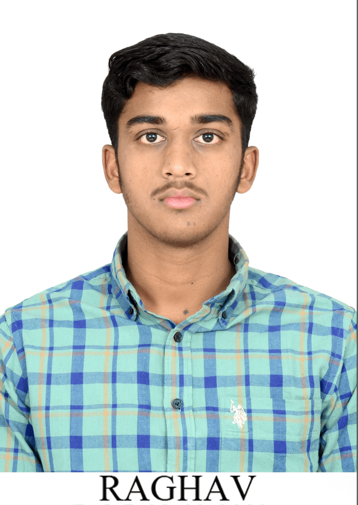

# Raghav Bansal — Executive Portfolio & Information Hub

Official digital portfolio and professional information page of **Raghav Bansal**.

🔗 **Live Production URL:** [https://about-me-sable-two-19.vercel.app](https://about-me-sable-two-19.vercel.app)

---

## 🌟 Profile Highlights

- 🎓 **Education**: B.Tech in Agricultural Engineering at **CCS HAU Hisar** (Class of 2028).
- 🎖️ **NCC Service**: Senior Cadet, Final Year NCC with **NCC 'B' Certificate ('A' Grade)**.
- 📐 **CAD & 3D Engineering**: 50+ 3D models designed in **Autodesk Fusion 360** & core expertise in **AutoCAD**.
- 🤖 **Prompt Engineering & AI**: Advanced Prompt Engineering for diverse technical problem-solving, LLM orchestration, and workflow automation.
- 🌾 **Core Vision**: Smart machinery and software for **Farmer Welfare**, sustainable development, and driving **Viksit Bharat by 2047**.

---

## 🚀 Featured Applications & Deployments

- 🪐 **[Astronomy with Antigravity](https://astronomy-with-antigravity.vercel.app)** — Celestial visualization and physics exploration platform (Live on Vercel).
- 🛡️ **[Main Portal NCC](https://main-portal-ncc-01.vercel.app)** — Digital operations & management portal for NCC (Live on Vercel).
- 🌾 **[Rathee Agro Egg Works](https://raghavbansal0704.github.io/rathee-agro-egg-works-/)** — Agro-tech management web application (GitHub Pages).
- 🌐 **[BHUMI Web Platform](https://raghavbansal0704.github.io/BHUMI/)** — Digital services and environmental awareness platform (GitHub Pages).
- 📅 **[DATE 1502](https://raghavbansal0704.github.io/DATE1502/)** — Interactive web application with dynamic animations (GitHub Pages).
- 🪙 **[Coin Toss Simulator 01](https://raghavbansal0704.github.io/coin-toss-simulation-01/)** & **[Coin Toss Simulator 02](https://raghavbansal0704.github.io/coin-toss-simulation-02/)** — Mathematical probability simulation engines (GitHub Pages).

---

## 🎨 Theme & UI Architecture

- **1-Click Dual Theme Switcher**: Instant switching between **Executive Light & Warm Gold Theme** and **Google Antigravity Dark Surface UI Theme**.
- **Interactive 3D Depth Tilt**: Real-time cursor depth vector tracking with spatial `translateZ`.
- **Reactive Micro-Interactions**: Particle trail bursts, dual-theme glowing edge highlights, and scroll-triggered entrance reveals.
- **Mobile Responsive**: Fully responsive layout optimized across mobile, tablet, and ultra-wide screens.

---

## 📬 Connect

- 📧 **Email**: [raghavbansal0704@gmail.com](mailto:raghavbansal0704@gmail.com)
- 💼 **LinkedIn**: [Raghav Bansal](https://www.linkedin.com/in/raghav-bansal-04a252328)
- 📷 **Instagram**: [@raghavbansal0704](https://www.instagram.com/raghavbansal0704)
- 🐙 **GitHub**: [raghavbansal0704](https://github.com/raghavbansal0704)
